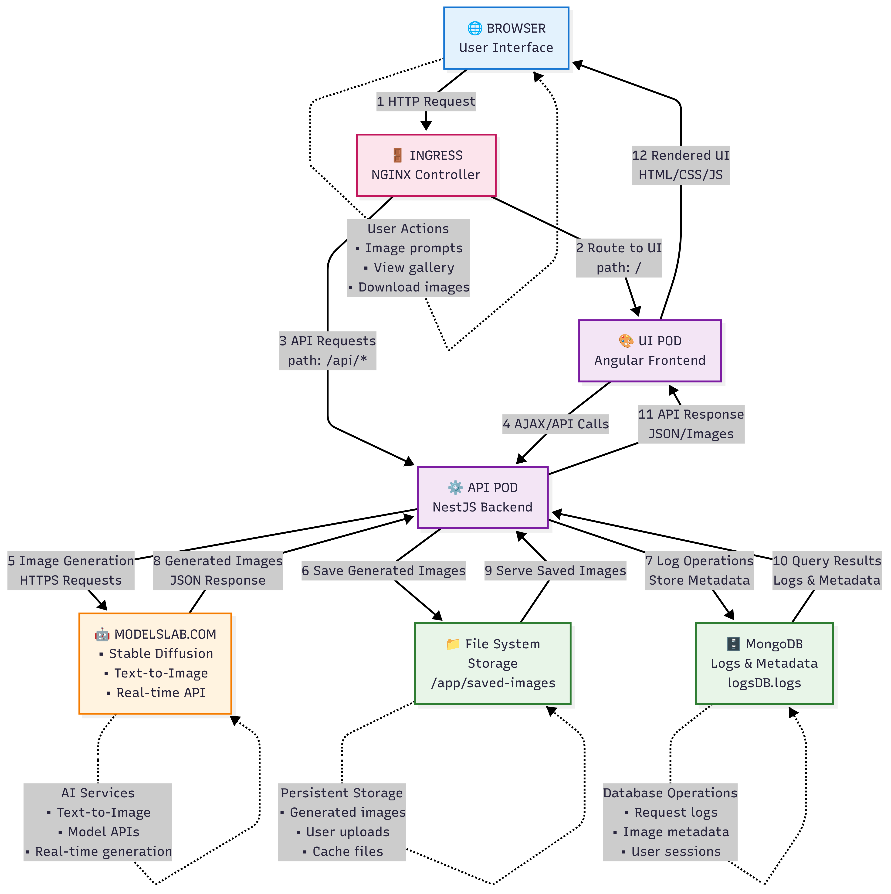
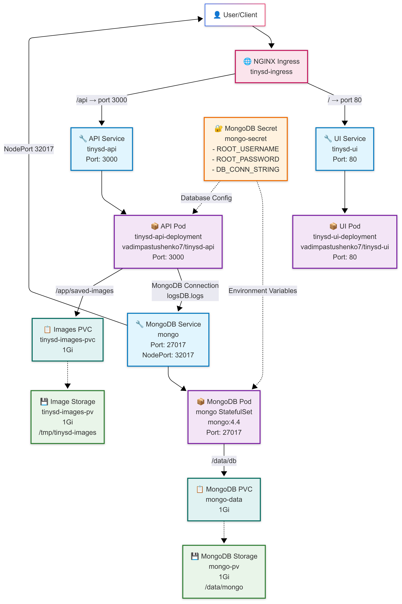
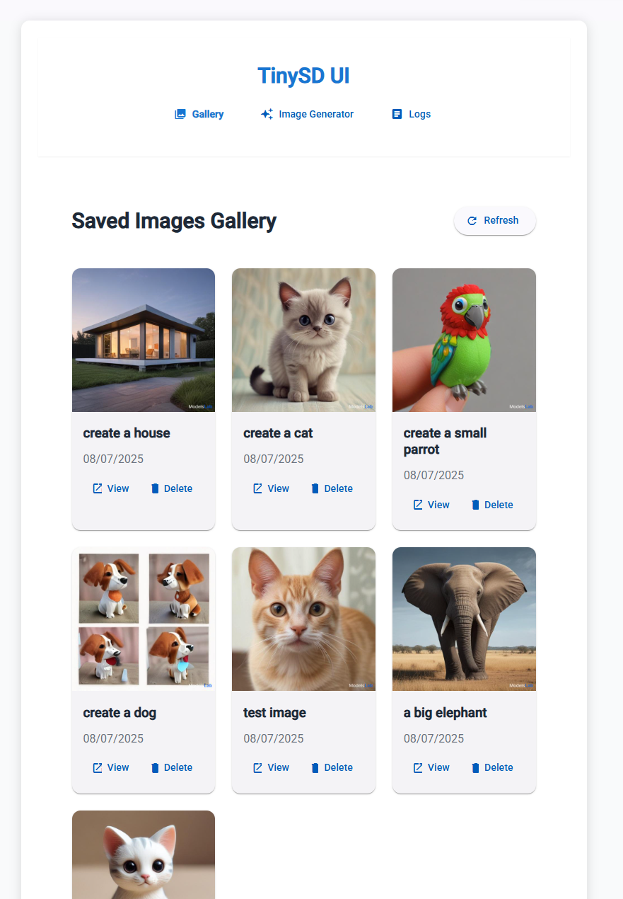

# TinySD App Monorepo

This is a migrated version of the TinySD application, now structured as an Nx monorepo with separate API and UI applications.

## Architecture

- **API** (`apps/api`): NestJS backend application
- **UI** (`apps/ui`): Angular frontend application
- **Database**: MongoDB with collections for logs, images, and settings

### Application Architecture



_High-level view of the TinySD application showing the interaction between UI, API, and external services_

### Kubernetes Deployment Architecture



_Kubernetes deployment structure showing pods, services, and storage components_

### UI Components Structure



_Angular UI component structure and navigation flow_

## Migration Changes

The old separate `tinysd-api` and `tinysd-ui` applications have been migrated to this monorepo structure:

- All API modules (database, logs, image) have been preserved
- All UI components and services have been preserved
- Docker configurations adapted for monorepo build process
- Kubernetes configurations updated for new image structure

## Development

### Prerequisites

- Node.js 20+
- npm
- Docker (for containerization)
- Kubernetes (for deployment)

### Install Dependencies

```bash
npm install
```

### Development Servers

```bash
# Start API development server
npm run serve:api

# Start UI development server
npm run serve:ui
```

### Build

```bash
# Build both applications
npm run build

# Build API only
npm run build:api

# Build UI only
npm run build:ui
```

### Testing

```bash
# Run tests
npm run test

# Run linting
npm run lint
```

## Docker

### Local Development with Docker Compose

```bash
# Build and start all services
npm run docker:up

# Stop services
npm run docker:down
```

Services will be available at:

- API: http://localhost:3000
- UI: http://localhost:4200
- MongoDB: localhost:27017

### Build Individual Docker Images

```bash
# Build API image
docker build -f apps/api/Dockerfile -t tinysd-api .

# Build UI image
docker build -f apps/ui/Dockerfile -t tinysd-ui .
```

## Kubernetes Deployment

### Prerequisites

- Kubernetes cluster
- kubectl configured

### Deploy Database

```bash
kubectl apply -f k8s-db.yaml
```

### Deploy Application

```bash
kubectl apply -f k8s-app.yaml
```

### Or use the npm scripts

```bash
# Deploy everything
npm run k8s:apply

# Remove everything
npm run k8s:delete
```

## Environment Variables

### API Environment Variables

- `DB_CONN_STRING`: MongoDB connection string
- `DB_NAME`: Database name (default: tinysd)
- `PORT`: API port (default: 3000)

### Setting up MongoDB Secret

The application expects a Kubernetes secret named `mongo-secret` with:

- `DB_CONN_STRING`: Base64 encoded connection string
- `ROOT_USERNAME`: Base64 encoded username
- `ROOT_PASSWORD`: Base64 encoded password

## API Testing

Use the included test script:

```bash
./test-api.sh
```

## Project Structure

```
tinysd-app-monorepo/
├── apps/
│   ├── api/                    # NestJS API application
│   │   ├── src/
│   │   │   ├── app/
│   │   │   │   ├── database/   # Database connection module
│   │   │   │   ├── logs/       # Logging module
│   │   │   │   ├── image/      # Image generation module
│   │   │   │   └── ...
│   │   │   └── main.ts
│   │   ├── saved-images/       # Saved images storage
│   │   └── Dockerfile
│   └── ui/                     # Angular UI application
│       ├── src/
│       │   ├── app/
│       │   │   ├── components/ # UI components
│       │   │   ├── services/   # Angular services
│       │   │   └── ...
│       │   └── main.ts
│       ├── nginx.conf
│       └── Dockerfile
├── k8s-app.yaml               # Kubernetes app deployment
├── k8s-db.yaml               # Kubernetes database deployment
├── docker-compose.yml        # Docker Compose configuration
└── package.json              # Monorepo dependencies
```

## Features

- **Image Generation**: Generate AI images using multiple providers
- **Image Gallery**: View and manage saved images
- **Logging**: Track all application events
- **Settings Management**: Configure image generation providers
- **Kubernetes Ready**: Full K8s deployment configurations
- **Docker Support**: Development and production Docker setups

## Finish your CI setup

[Click here to finish setting up your workspace!](https://cloud.nx.app/connect/C00t8Bobwj)

## Run tasks

To run the dev server for your app, use:

```sh
npx nx serve ui
```

To create a production bundle:

```sh
npx nx build ui
```

To see all available targets to run for a project, run:

```sh
npx nx show project ui
```

These targets are either [inferred automatically](https://nx.dev/concepts/inferred-tasks?utm_source=nx_project&utm_medium=readme&utm_campaign=nx_projects) or defined in the `project.json` or `package.json` files.

[More about running tasks in the docs &raquo;](https://nx.dev/features/run-tasks?utm_source=nx_project&utm_medium=readme&utm_campaign=nx_projects)

## Add new projects

While you could add new projects to your workspace manually, you might want to leverage [Nx plugins](https://nx.dev/concepts/nx-plugins?utm_source=nx_project&utm_medium=readme&utm_campaign=nx_projects) and their [code generation](https://nx.dev/features/generate-code?utm_source=nx_project&utm_medium=readme&utm_campaign=nx_projects) feature.

Use the plugin's generator to create new projects.

To generate a new application, use:

```sh
npx nx g @nx/angular:app demo
```

To generate a new library, use:

```sh
npx nx g @nx/angular:lib mylib
```

You can use `npx nx list` to get a list of installed plugins. Then, run `npx nx list <plugin-name>` to learn about more specific capabilities of a particular plugin. Alternatively, [install Nx Console](https://nx.dev/getting-started/editor-setup?utm_source=nx_project&utm_medium=readme&utm_campaign=nx_projects) to browse plugins and generators in your IDE.

[Learn more about Nx plugins &raquo;](https://nx.dev/concepts/nx-plugins?utm_source=nx_project&utm_medium=readme&utm_campaign=nx_projects) | [Browse the plugin registry &raquo;](https://nx.dev/plugin-registry?utm_source=nx_project&utm_medium=readme&utm_campaign=nx_projects)

[Learn more about Nx on CI](https://nx.dev/ci/intro/ci-with-nx#ready-get-started-with-your-provider?utm_source=nx_project&utm_medium=readme&utm_campaign=nx_projects)

## Install Nx Console

Nx Console is an editor extension that enriches your developer experience. It lets you run tasks, generate code, and improves code autocompletion in your IDE. It is available for VSCode and IntelliJ.

[Install Nx Console &raquo;](https://nx.dev/getting-started/editor-setup?utm_source=nx_project&utm_medium=readme&utm_campaign=nx_projects)

## Useful links

Learn more:

- [Learn more about this workspace setup](https://nx.dev/getting-started/tutorials/angular-monorepo-tutorial?utm_source=nx_project&utm_medium=readme&utm_campaign=nx_projects)
- [Learn about Nx on CI](https://nx.dev/ci/intro/ci-with-nx?utm_source=nx_project&utm_medium=readme&utm_campaign=nx_projects)
- [Releasing Packages with Nx release](https://nx.dev/features/manage-releases?utm_source=nx_project&utm_medium=readme&utm_campaign=nx_projects)
- [What are Nx plugins?](https://nx.dev/concepts/nx-plugins?utm_source=nx_project&utm_medium=readme&utm_campaign=nx_projects)

And join the Nx community:

- [Discord](https://go.nx.dev/community)
- [Follow us on X](https://twitter.com/nxdevtools) or [LinkedIn](https://www.linkedin.com/company/nrwl)
- [Our Youtube channel](https://www.youtube.com/@nxdevtools)
- [Our blog](https://nx.dev/blog?utm_source=nx_project&utm_medium=readme&utm_campaign=nx_projects)
